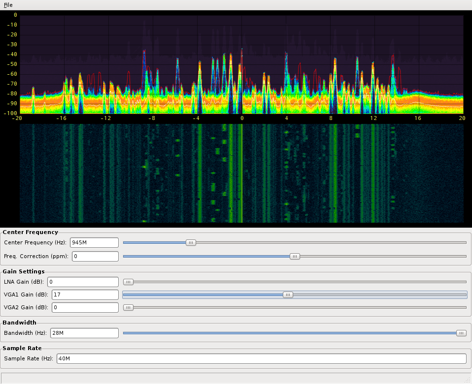

# gr-fosphor-vm

### GNU Radio block for RTSA-like spectrum visualization using OpenCL and OpenGL

## Installation Instructions

https://osmocom.org/projects/sdr/wiki/fosphor

### Authors
Sylvain Munaut <tnt@246tNt.com>
Dimitri Stolnikov <horiz0n@gmx.net>
